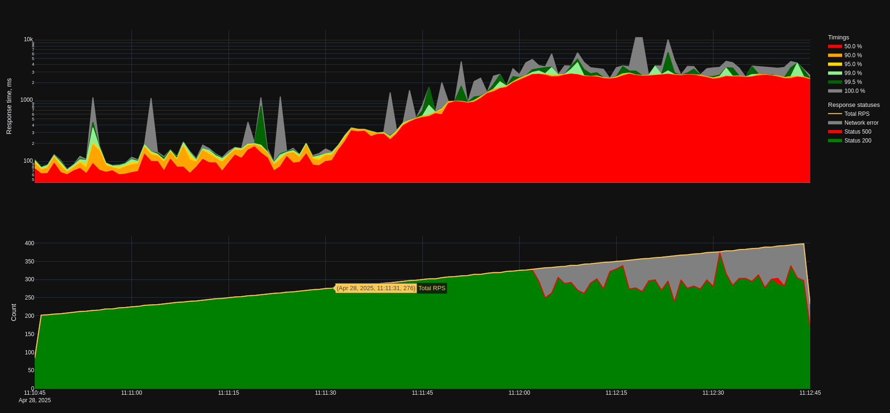

# Производительность асинхронного драйвера базы данных

Проверяю изменится ли и если да, то насколько, производительность приложения при переходе с синхронного драйвера базы данных на асинхронный.

## Окружение

В качестве сервера выступает двух-ядерная виртуальная машина с ОС Debian 12, на которой запущены два контейнера - один с приложением и один с базой данных Postgres 17.4. На хосте также установлен nginx в качестве reverse proxy.

Нагрузку создавал с помощью yandex-tank (`./pleh.sh bench` предварительно настроив конфиг в docs/load.yaml).

## Контрольные показатели

Результаты тестирования с синхронным драйвером базы данных проводилось на версии приложения v0.1.1. В качестве тестового запроса был выбран запрос списка ингредиентов.

Деградация таймингов наблюдалась при ~280 RPS. График с распределением таймингов ответа сервиса в зависимости от нагрузки

График нарисован с помощью скрипта `plot_phout.py`.