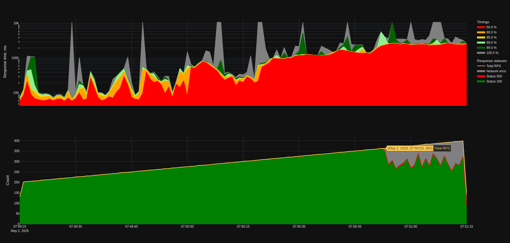

# Производительность асинхронного драйвера базы данных

Проверяю изменится ли и если да, то насколько, производительность приложения при переходе с синхронного драйвера базы данных на асинхронный.

## Окружение

В качестве сервера выступает двух-ядерная виртуальная машина с ОС Debian 12, на которой запущены два контейнера - один с приложением и один с базой данных Postgres 17.4. На хосте также установлен nginx в качестве reverse proxy.

Нагрузку создавал с помощью yandex-tank (`./pleh.sh bench` предварительно настроив конфиг в docs/load.yaml).

## Контрольные показатели

Результаты тестирования с синхронным драйвером базы данных проводилось на версии приложения v0.1.1. В качестве тестового запроса был выбран запрос списка ингредиентов.

Деградация таймингов наблюдалась при ~280 RPS. График с распределением таймингов ответа сервиса в зависимости от нагрузки

График нарисован с помощью скрипта `plot_phout.py`.

## Результаты

Тестирование с асинхронным драйвером базы данных выполнялся в версии приложения v0.2.1. В качестве драйвера использовался asyncpg.

Картина таймингов несколько изменилась. Если раньше был очевиден рост таймингов вместе с ростом нагрузки, то теперь корреляция не так очевидна - высокие тайминги появляются на графике раньше, чем в случае с синхронным драйвером.

Однако несмотря на более нестабильные значения таймингов сервис оказался обработать больше запросов в секунду без сетевых ошибок. Деградация началась при ~360 RPS против ~330 RPS на синхронном драйвере (увеличение на 10%).

## Итоги

В текущей конфигурации сервера преимущества применения асинхронного драйвера для базы данных есть, но не так велики, как ожидалось, особенно учитывая ухудшившиеся тайминги ответа сервера. По косвенным показателям можно судить, что узким горлышком стал не IO, а CPU (было замечено ~60% использования CPU на двухядерном сервере - учитывая, что интерпретатор python однопоточный, можно сделать вывод, что он исчерпал выделенный ему ресурс). Для того, чтобы лучше изучить влияние асинхронного драйвера, нужно лучше продиагностировать текущую реализацию и её узкие места.
