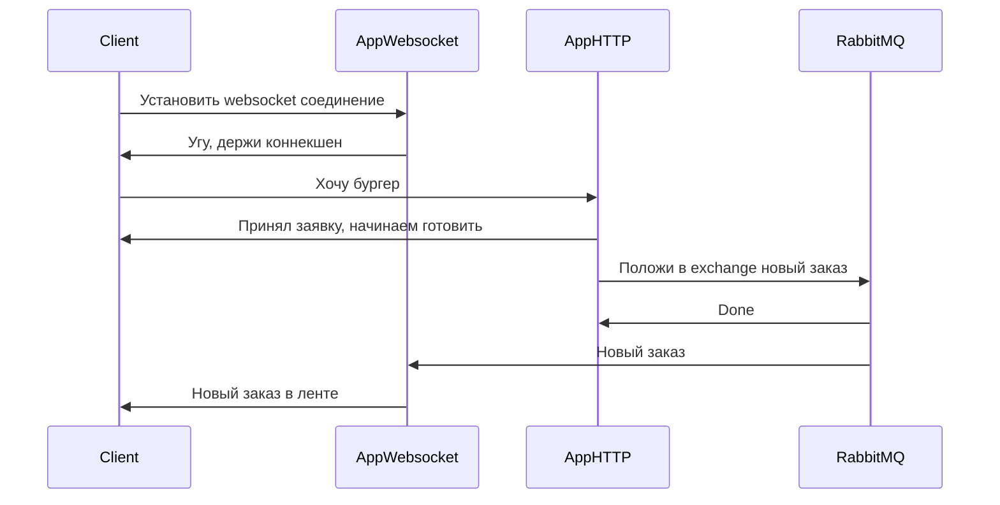

# Логика нотификаций по websocket

## Как сейчас

В текущей реализации (v0.3.0-rc0) все новые заказы при создании отправляются по websocket на клиент. Но передача данных о создании нового заказа происходит в рамках одного процесса. В случае необходимости горизонтального масштабирования (или даже просто при необходимости запустить больше чем один процесс) этот функционал сломается.

Необходимо переработать передачу информации о новых заказах так, чтобы решить сложившуюся проблему.

## Решение

Реализовать доставку информации о новых заказах в брокер сообщений, который позволит подписаться сразу нескольким процессам на новые заказы.

Каждый обработчик websocket соединения будет создавать свою уникальную очередь сообщений в RabbitMQ на получение всех новых заказов и будет добавлять эту очередь в единый exchange. Таким образом, каждый websocket-обработчик будет получать все новые заказы, но сами обработчики умеют отфильтровывать нужные им заказы.

## Диаграмма сообщений

