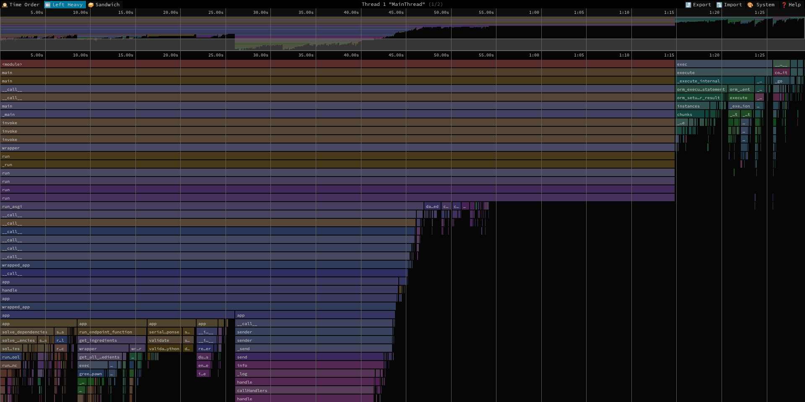
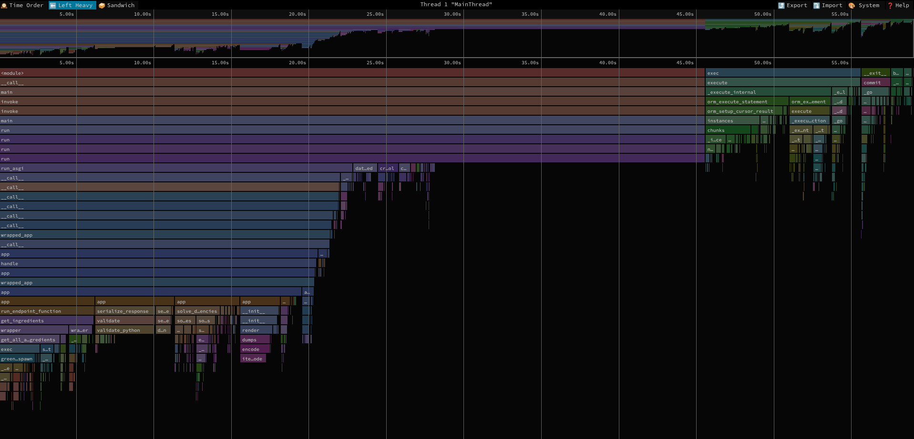
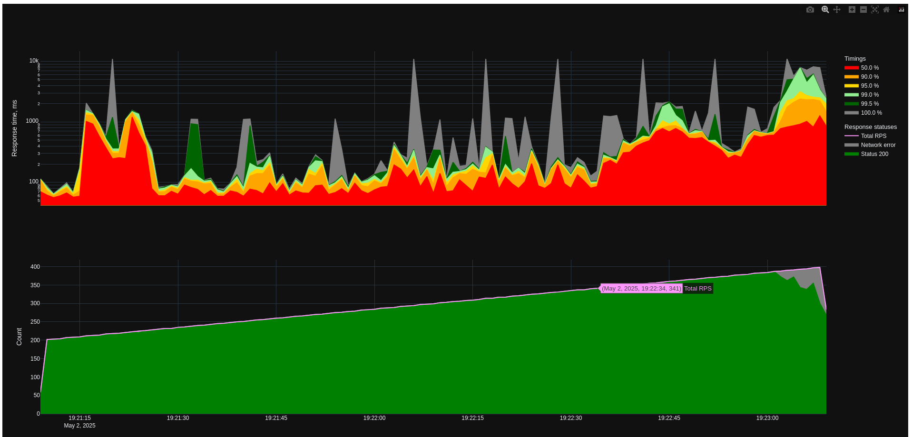

# Оптимизации производительности

## Предусловия

Прежде чем улучшать производительность приложения, изначально было необходимо её оценить, после чего определить наиболее ресурсно-затратные участки.

С изначальным уровнем производительности приложения можно ознакомиться в документе [по подключению асинхронного драйвера баз данных](./async_driver_perfomance.md). TL;DR: адекватные тайминги до 280 RPS и полная деградация работы приложения при 360 RPS.

На той же версии приложения и на той же виртуальной машине был проведён профайлинг с помощью py-spy. Генерировалась линейно увеличивающаяся нагрузка на сервер со 100 RPS до 200 RPS в течение 2 минут. Результаты профилирования сохранены в [файле](./speedscope/2025-05-02_15-25-13_control.prof). Ниже скрин визуализации

Из интересного - непосредственно код ручки занимает ~8% всего времени (на графике функция `get_ingredients`). Но вообще почему-то есть отдельно нарисованный блок с запросами sqlmodel/sqlalchemy ~16%. И даже если объединить их, то бизнес логика занимает не больше 25% всего времени.

Наиболее очевидным место для оптимизации выглядят логи - можно получить до 20%.

Также можно заметить, что ~8% занимает разрешение зависимостей, половина из которых - синхронные функции, запускаемые в threadpool. Возможно, если сделать их асинхронными, то время их работы сильно сократится.

## Первый подход

Применил оптимизации, предложенные выше и произвёл замеры на версии приложения v0.3.0_dev0. Сначала рассмотрим графики.

Speedscope с линейным ростом нагрузки со 100 до 200 RPS в течение 2 минут:

И нагрузочный тест на тайминги с линейной нагрузкой с 200 до 400 RPS в течение 2 минут:

Во-первых, видно что время CPU в диаграмме speedscope уменьшилось со 130 секунд до 60 секунд. Логирование ушло с диаграммы совсем.

Также разрешение зависимостей уменьшилось с 8.5 секунд до 4.2 секунд.

То есть изначальные предположения подтвердились.

Во-вторых, в нагрузочном тесте результаты также улучшились. Приложение поддерживает стабильные тайминги меньше 100 ms (с редкими прострелами) вплоть до 340 RPS по сравнению с 280 RPS ранее - улучшение 20% по сравнению с контрольным значением. Также полная деградация наступила при 390 RPS, а не 360 как ранее - улучшение 8% по сравнению с контрольным значением.
