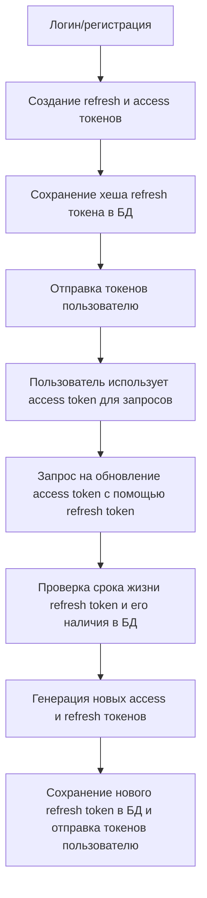

# Инвалидация токенов

## Проверка валидности токенов

Валидность токенов проверяется по дате истечения, которая хранится в самом токене. Однако пользователь может выйти из системы до истечения срока действия токена. В этом случае все ранее выданные токены должны стать невалидными.

## Система управления токенами

Для упрощения реализации в текущем приложении предполагается, что у пользователя может быть только одна активная сессия. В рамках этой системы:

1. У пользователя одновременно может быть не более двух валидных токенов:
   - Один accessToken - для проверки доступа к API
   - Один refreshToken - только для обновления accessToken

## Жизненный цикл токенов

## Процедура выхода из системы (logout)

При запросе logout:
1. Удаляем refresh token пользователя из базы данных
2. Записываем дату logout в профиль пользователя

Если после logout приходит токен с датой выдачи, предшествующей дате logout, такой токен считается невалидным.
